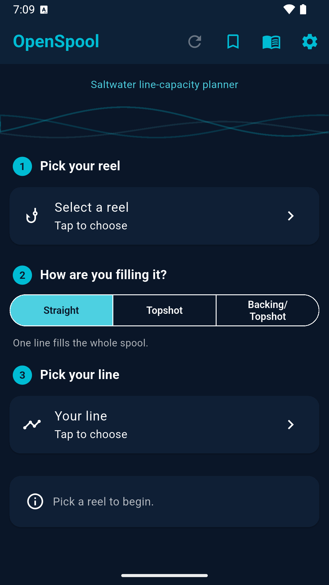
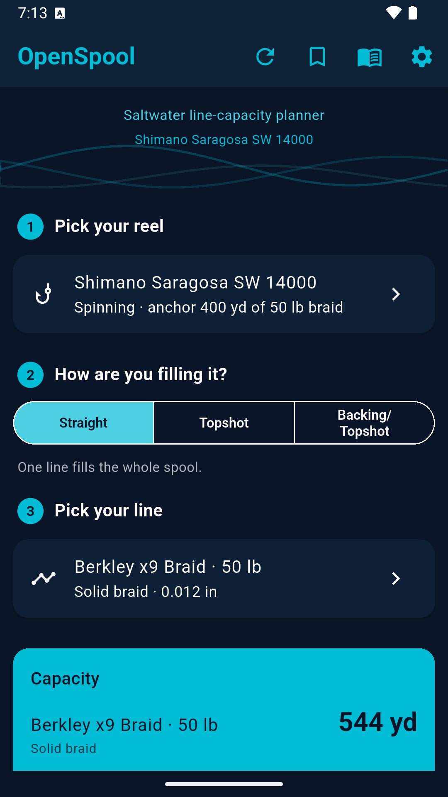
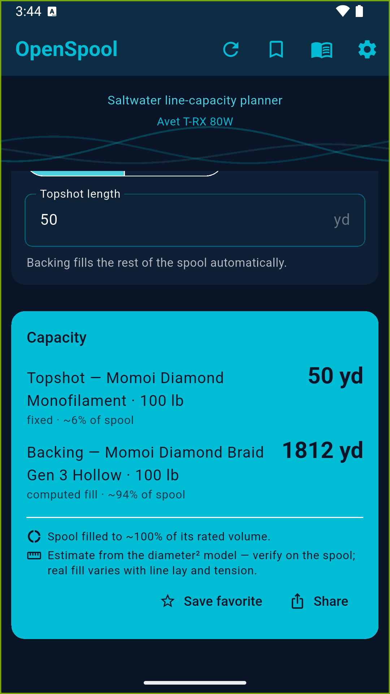
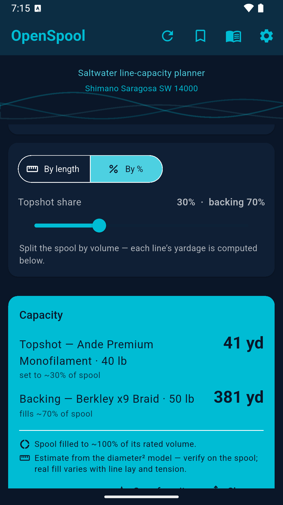
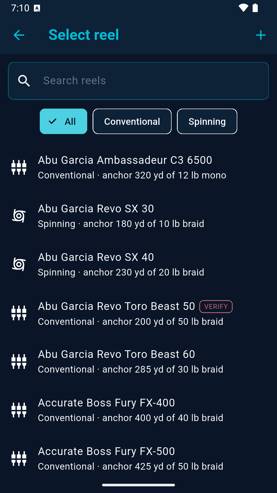
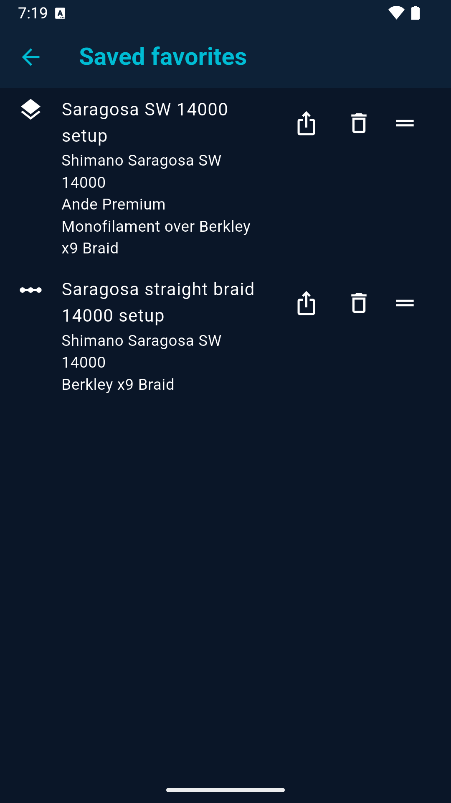

# OpenSpool

*(formerly "Reel Capacity Planner")*

A standalone Android app (Flutter) for planning **line capacity on saltwater reels** —
spinning and conventional — across **mono**, **solid-core braid**, and **hollow-core braid**,
including **topshot mixes** (a fixed topshot over backing that fills the rest of the spool).

> Separate project from OpenTides — its own repo, package, and Play listing.

## Screenshots

| Calculator | Straight result | Topshot + backing |
|:---:|:---:|:---:|
|  |  |  |
| **Split by length / %** | **Reel picker** | **Favorites** |
|  |  |  |

## How the math works

Line occupies spool volume proportional to `length × diameter²`. Each reel is anchored to **one
published capacity**, giving a spool constant:

```
K = anchorYards × anchorDiameter² × anchorPackingFactor     (inches)
```

Any other line of diameter `d` then fills `yards = K / (d² × packingFactor)`. A topshot mix pins one
segment to a fixed length, subtracts its volume, and fills the remainder with the other line.

**Why `packingFactor`:** published braid diameters understate how much spool volume the line really
occupies once it's wound (hollow core worst), so a naive mono-anchored diameter² conversion badly
over-estimates braid. Each line construction carries a calibrated factor — mono/fluoro `1.0`,
solid braid `1.2`, hollow braid `1.85` — and a reel applies the same factor to its anchor capacity
so braid-anchored and mono-anchored reels stay consistent. The factors are calibrated against real
spool data (Penn Fathom 40N solid-braid capacities; an Avet 80W holding ~1,900 yd of 100 lb hollow).
A per-line `packing_factor` in the catalog JSON overrides the type default.

The engine lives in `lib/services/capacity_calculator.dart` (pure Dart, no Flutter deps) and is
covered by `test/capacity_calculator_test.dart`.

> ⚠️ **Results are estimates.** Real fill depends on how evenly line is laid and how tight it is
> packed. Catalog entries whose `source` contains **`VERIFY`** are approximate placeholders and
> must be confirmed against current manufacturer spec sheets before the numbers are trusted. Line
> **diameter** is the accuracy-critical field.

## Data

- Read-only seed catalog ships as JSON assets: `assets/data/reels.json`, `assets/data/lines.json`.
- User data — saved loadouts plus any custom reels/lines — is stored locally in SQLite
  (`lib/data/db.dart`). Custom catalog entries merge with the seed at load.

## Project layout

```
lib/
  main.dart, app_state.dart
  models/      reel, line, line_segment, loadout (+ enums)
  services/    capacity_calculator (engine), unit_converter, settings
  data/        catalog (asset+db loader), db (sqflite), loadout_repository
  ui/screens/  home (calculator), reel_picker, line_picker, loadouts, settings
  ui/widgets/  capacity_result_card
  theme/       app_theme
assets/data/   reels.json, lines.json
test/          capacity_calculator_test.dart
```

## Build / run

Flutter SDK lives in the `ubuntu-chrome` container (`/root/flutter/bin/flutter`); the project is
synced to `/root/reel_planner` there to build against the Pixel9 emulator.

```bash
flutter pub get
flutter test
flutter build apk --release
# install on emulator (adb at /opt/android-sdk/platform-tools/adb in the container)
adb install -r build/app/outputs/flutter-apk/app-release.apk
```

App id: `com.mattbettinger.openspool`.

## Internal docs & process

- [`docs/INTERNALS.md`](docs/INTERNALS.md) — behavior-level reference: UI flows, favorites
  (save/dedupe/delete+undo/reorder), persistence shape, and the regression guards. **Kept in sync
  with the code.**
- [`docs/PREBUILD.md`](docs/PREBUILD.md) — the pre-build checklist. Updating the docs above when a
  change alters a flow/screen/behavior is **step 1 of every build**, not an afterthought.
- QA: the `reel-qa` skill drives a full-app walkthrough on the emulator and enforces the doc-sync step.

## v1 scope / not yet

Mix is backing + topshot (2 segments). Not yet: 3+ segments, remote catalog sync, iOS build,
empirical per-brand packing calibration, loadout import/export.

## Contributing

The highest-value contribution is **accurate data** — correct line diameters and reel capacity
anchors with a manufacturer source. See [`CONTRIBUTING.md`](CONTRIBUTING.md). Wrong number?
Open an issue or use the email link in the app's Settings.

## Privacy

OpenSpool collects no data and makes no network requests — everything runs offline on your
device. See [`PRIVACY.md`](PRIVACY.md) (hosted:
<https://silasmarner.github.io/open-spool/privacy.html>).

## License

[MIT](LICENSE) © 2026 Matt Bettinger.
